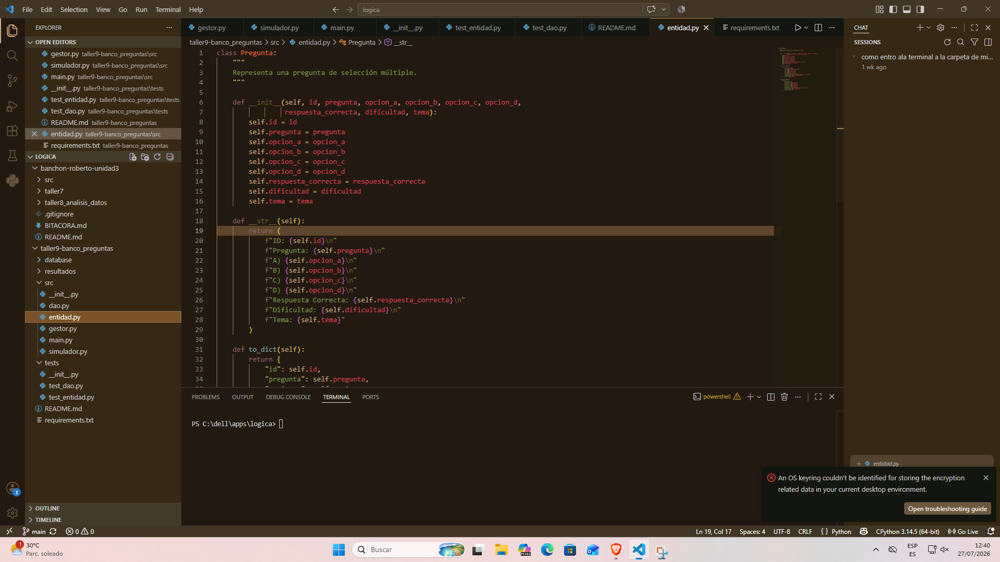

# Sistema de Banco de Preguntas - Taller 9

## Descripción General

Este proyecto consiste en el desarrollo de una aplicación en Python para la gestión de un banco de preguntas de selección múltiple. El sistema permitirá cargar preguntas desde archivos de texto (TXT), CSV y JSON, almacenarlas en una base de datos SQLite y realizar simulaciones de evaluaciones, además de generar reportes y estadísticas.

---

## Integrantes del Grupo

* Roberto Steven Banchón Muñoz

---

## Fechas

* **Fecha de inicio:** 27/07/2026
* **Fecha de entrega:** 27/07/2026

---

## Tecnologías Utilizadas

* Python 3
* SQLite3
* Git
* GitHub
* Visual Studio Code

---

## Estructura del Proyecto

```text
taller9/
│
├── preguntas.txt
├── preguntas.csv
├── preguntas.json
├── README.md
├── requirements.txt
│
├── src/
│   ├── __init__.py
│   ├── entidad.py
│   ├── dao.py
│   ├── gestor.py
│   ├── simulador.py
│   └── main.py
│
├── database/
│
├── resultados/
│
└── tests/
    ├── __init__.py
    ├── test_entidad.py
    └── test_dao.py
```

---

#  Evidencias de Ejecución por Iteración

##  Iteración 1: Configuración Inicial

### Actividades realizadas

* Se creó la estructura de carpetas del proyecto.
* Se creó el archivo `requirements.txt`.
* Se creó el archivo `README.md`.
* Se creó la carpeta `src` con los archivos base del proyecto.
* Se creó la carpeta `tests`.
* Se preparó la estructura para el desarrollo del sistema.

### Evidencias

**Evidencia 1:** Captura de la estructura de carpetas del proyecto.



---

## Pruebas Realizadas

Pendiente de implementación en las siguientes iteraciones.

---

## Estadísticas Finales

Pendiente de implementación.

---

## Conclusiones

La primera iteración permitió preparar la estructura base del proyecto y organizar los archivos necesarios para facilitar el desarrollo de las siguientes etapas.

---

## Mejoras Futuras

* Implementar la entidad Pregunta.
* Integrar la base de datos SQLite.
* Implementar el gestor de preguntas.
* Desarrollar el simulador de evaluación.
* Generar reportes y estadísticas.
